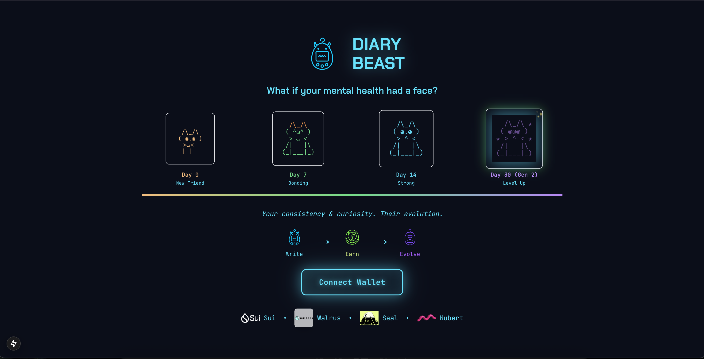
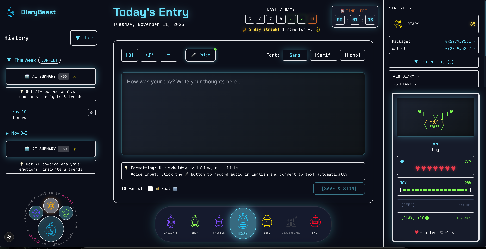
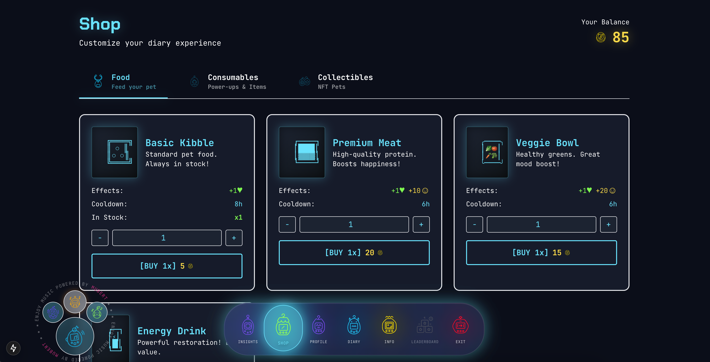

# DiaryBeast

Write in your diary daily to feed and evolve your personal beast. AI analyzes your emotions to unlock psychological archetypes, generate custom music, and reveal rare collectible creatures.

## 🏆 Walrus Haulout Hackathon

**This project is participating in the [Walrus Haulout Hackathon](https://www.walrus.xyz/haulout) (November 6-16, 2025)**

DiaryBeast leverages **Walrus** for decentralized storage, **Seal** for threshold-based encryption, and **Sui** blockchain for token economy, competing in the **Data Security & Privacy** and **Provably Authentic** tracks.

- 🏅 **Hackathon**: [Walrus Haulout Hackathon](https://www.walrus.xyz/haulout)
- 📅 **Dates**: November 6-16, 2025
- 🎯 **Tracks**: Data Security & Privacy, Provably Authentic
- 💰 **Prize Pool**: $100,000+ in prizes

## 📸 Screenshots

## 🚀 Features

- **Decentralized Storage**: Diary entries stored on Walrus (decentralized storage)
- **Blockchain Integration**: Sui blockchain for tokens and transactions
- **Sponsored Transactions**: Users don't pay gas fees (admin sponsors)
- **AI Analysis**: Weekly emotion analysis and insights
- **Gamification**: Pet system with rewards and streaks
- **End-to-End Encryption**: Client-side encryption for privacy (crypto-js by default)
- **Optional Seal Encryption**: Enhanced privacy with threshold-based encryption (user choice)

## 📚 Documentation

For detailed documentation, please visit the [docs](/docs) folder:

- [Quick Start Guide](/docs/Quick-Start.md) - Get started in 5 minutes
- [Hackathon Highlights](/docs/Hackathon-Highlights.md) - Key features for judges
- [Architecture Overview](/docs/Architecture.md) - System architecture
- [Setup Guide](/docs/Setup-Guide.md) - Complete environment setup
- [API Reference](/docs/API-Reference.md) - All API endpoints
- [Development Guide](/docs/Development.md) - Development workflow
- [Migration Guide](/docs/Migration.md) - Migration from Base to Sui

### Core Technologies
- [Walrus Integration](/docs/Walrus-Integration.md) - Decentralized storage
- [Seal Encryption](/docs/Seal-Encryption.md) - Threshold-based encryption
- [Sui Blockchain](/docs/Sui-Blockchain.md) - Smart contracts and token economy
- [Gamification System](/docs/Gamification.md) - Pet system, streaks, and rewards

## 🎮 Gamification

DiaryBeast features a comprehensive gamification system to encourage consistent journaling:

### Pet Life System
- **7 Lives**: Start with 7 lives for your virtual pet
- **Life Restoration**: Writing entries restores +2 lives
- **Life Loss**: 1 life lost per 24 hours of inactivity (after 24h grace period)
- **Pet States**: Happy (4-7 lives), Sad (1-3 lives), Critical (0 lives)

### Streak System
- **Consecutive Days**: Track your journaling streak
- **Milestone Bonuses**: Earn bonus tokens at 3, 7, 14, 30, 60, 90, 180, and 365 days
- **Reward Multipliers**: Based on pet condition (happiness and lives)
- **Streak Reset**: Resets if you miss a day or pet loses all lives

### Token Rewards
- **Base Reward**: 10 tokens per entry
- **Reward Multipliers**: Based on pet condition (higher happiness/lives = higher multiplier)
- **Milestone Bonuses**: 5 to 5,000 tokens for achievements (multiplied by reward multiplier)
- **Shop Items**: Spend tokens on food, items, and customization

### Shop System
- **Food Items**: Restore lives and happiness (5-50 tokens)
- **Consumable Items**: Special effects like health potions (50-150 tokens)
- **Customization**: Backgrounds and accessories for your pet
- **Soul-Bound**: All items are non-transferable (soul-bound)

See [Gamification System](/docs/Gamification.md) for detailed information.

## 🏗️ Architecture

### Storage
- **Walrus**: Decentralized storage for encrypted diary entries
- **PostgreSQL**: Metadata storage for fast queries
- **Hybrid Model**: Best of both worlds (decentralized + fast queries)

### Blockchain
- **Sui Blockchain**: Token economy and transactions
- **Sponsored Transactions**: Admin pays gas fees
- **Move Smart Contracts**: Token minting and burning

### Security
- **Client-Side Encryption**: Entries encrypted before upload
- **Deterministic Keys**: Keys derived from wallet address (crypto-js)
- **Optional Seal Encryption**: Enhanced privacy with threshold-based encryption (user choice)
- **AI Analysis**: Server can decrypt crypto-js entries for AI analysis; Seal-encrypted entries excluded

### How It Works

**Default Encryption (crypto-js):**
- All entries are encrypted with crypto-js by default
- Server can decrypt for AI analysis
- Fast and simple

**Optional Seal Encryption:**
- Users can enable Seal encryption per entry via checkbox in the editor
- Entry is encrypted with distributed key servers
- **Only the user can decrypt** by signing with their wallet
- **No one else, including the server, can read it** without the user's signature
- Stored differently in the database
- **Excluded from AI analysis** (for maximum privacy)

### Configuration

Seal is **optional** and can be enabled/disabled via environment variables:
- `SEAL_ENABLED` - Enable/disable Seal (default: true)
- `NEXT_PUBLIC_SEAL_OFFICIAL_PACKAGE_ID` - Official Seal package ID
- `NEXT_PUBLIC_SEAL_PACKAGE_ID` - Access policies package ID
- `SEAL_POLICY_REGISTRY_ID` - Policy Registry object ID
- `SEAL_KEY_SERVER_OBJECT_IDS` - Key server object IDs (comma-separated)
- `SEAL_DEFAULT_THRESHOLD` - Threshold for decryption (default: 2)

See [Seal Setup Guide](./lib/seal/SETUP.md) for detailed configuration.

## 🔗 Smart Contracts

### Main Contract: DiaryToken

**Location**: `sui-contracts/diarybeast_token/sources/diary_token.move`

**Purpose**: Soul-bound token for rewards and gamification

**Key Functions**:
- `mint_reward`: Admin mints tokens to users
- `burn`: Users burn tokens for purchases
- `burn_from`: Admin burns tokens from users

**Package ID**: Configured via environment variable `NEXT_PUBLIC_SUI_PACKAGE_ID` (testnet) or `NEXT_PUBLIC_SUI_PACKAGE_ID_MAINNET` (mainnet)

**Contract Details**:
- Module: `diarybeast::diary_token`
- Token Type: `DIARY_TOKEN`
- Decimals: 9
- TreasuryCap: Shared object (enables sponsored transactions)
- AdminCap: Owned object (admin-only operations)

### Seal Access Policies Contract

**Location**: `sui-contracts/diarybeast_seal_policies/sources/seal_policies.move`

**Purpose**: Access control for Seal encryption/decryption

**Key Functions**:
- `create_policy`: Create access policy for user
- `seal_approve`: Approve decryption access

**Package ID**: Configured via environment variable `NEXT_PUBLIC_SEAL_PACKAGE_ID`

## 📖 Additional Documentation

- [Seal README](./lib/seal/README.md) - Seal integration documentation
- [Seal Setup Guide](./lib/seal/SETUP.md) - Setup instructions
- [Seal Test Scripts](./scripts/seal-tests/README.md) - Test scripts documentation
