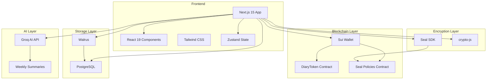

# Architecture Overview

This document provides a comprehensive overview of DiaryBeast's system architecture.

## System Architecture



## Component Architecture

### Frontend Components

```
app/
├── page.tsx              # Home page
├── diary/page.tsx        # Diary entry editor
├── profile/page.tsx      # User profile
├── shop/page.tsx         # Shop
├── insights/page.tsx     # Weekly insights
└── api/                  # API routes
    ├── entries/          # Entry CRUD
    ├── summary/          # AI summaries
    ├── shop/             # Shop operations
    ├── sponsored/        # Sponsored transactions
    └── user/             # User operations

components/
├── TextEditor.tsx        # Rich text editor
├── EntryViewer.tsx      # Entry display
├── WeeklyHistory.tsx    # Weekly history
├── Pet.tsx              # Pet display
└── WalletConnect.tsx    # Wallet connection
```

### Backend Services

```
lib/
├── sui/
│   ├── token.ts              # Token utilities
│   └── sponsored-transactions.ts  # Sponsored transactions
├── walrus/
│   ├── client-sdk.ts         # Walrus SDK client
│   └── config.ts             # Walrus configuration
├── seal/
│   ├── encryption.ts        # Seal encryption/decryption
│   ├── hybrid-encryption.ts # Hybrid encryption wrapper
│   ├── session-key.ts       # SessionKey management
│   ├── transaction.ts      # Transaction building
│   └── config.ts           # Seal configuration
└── entries/
    └── walrus-storage.ts    # Walrus storage functions
```

### Smart Contracts

```
sui-contracts/
├── diarybeast_token/
│   └── sources/
│       └── diary_token.move  # Token contract
└── diarybeast_seal_policies/
    └── sources/
        └── seal_policies.move  # Access policies contract
```

## Data Flow

### Entry Creation Flow

```
1. User writes entry in TextEditor
   ↓
2. Entry encrypted (crypto-js or Seal)
   ↓
3. Signature created (wallet signature)
   ↓
4. POST /api/entries
   ↓
5. Upload to Walrus (encrypted blob)
   ↓
6. Store metadata in PostgreSQL
   ↓
7. Mint tokens to user
   ↓
8. Update user stats (streak, lives)
```

### Entry Retrieval Flow

```
1. User views entry
   ↓
2. GET /api/entries/[id]
   ↓
3. Retrieve metadata from PostgreSQL
   ↓
4. Download encrypted blob from Walrus
   ↓
5. If Seal: Create SessionKey (wallet signature)
   ↓
6. Decrypt entry (crypto-js or Seal)
   ↓
7. Display entry to user
```

### AI Summary Flow

```
1. User requests weekly summary
   ↓
2. GET /api/summary/generate
   ↓
3. Fetch entries for week (exclude Seal-encrypted)
   ↓
4. Decrypt crypto-js entries (server-side)
   ↓
5. Send to Groq AI API
   ↓
6. Generate emotion analysis
   ↓
7. Store summary in database
   ↓
8. Return summary to user
```

## Storage Architecture

### Hybrid Storage Model

**Walrus (Decentralized)**:
- Encrypted diary entries (blobs)
- Content-addressed
- Verifiable on-chain
- ~$0.10/GB storage cost

**PostgreSQL (Centralized)**:
- User profiles
- Entry metadata (blob IDs, dates, word counts)
- Purchases and rewards
- Weekly summaries
- Fast queries and indexing

### Entry Storage

```typescript
// Entry in PostgreSQL
{
  id: string,
  userId: string,
  walrusBlobId: string,        // Pointer to Walrus
  walrusTxDigest: string,      // Transaction digest
  storageType: "walrus",
  signature: string,
  contentHash: string,
  wordCount: number,
  date: Date,
  // Seal metadata (optional)
  sealEncryptedObject?: string,
  sealPackageId?: string,
  sealId?: string,
  sealThreshold?: number,
}

// Encrypted blob on Walrus
{
  content: string,             // Base64 encrypted content
  signature: string,
  contentHash: string,
  timestamp: number,
  walletAddress: string,
  wordCount: number,
  // Seal metadata (optional)
  method?: "crypto-js" | "seal",
  sealEncryptedObject?: string,
  sealKey?: string,
  sealPackageId?: string,
  sealId?: string,
  sealThreshold?: number,
}
```

## Security Architecture

### Encryption Layers

1. **Default (crypto-js)**:
   - AES encryption
   - Key derived from wallet address
   - Server can decrypt for AI analysis

2. **Optional (Seal)**:
   - Threshold-based encryption
   - Identity-based (wallet address)
   - Only user can decrypt (wallet signature required)
   - Server cannot decrypt

### Access Control

- **Wallet Authentication**: Personal message signing
- **Onchain Policies**: Seal access policies (Move contract)
- **SessionKeys**: Time-limited decryption authorization

## Blockchain Architecture

### Token Economy

```
User writes entry
    ↓
Server mints DiaryToken
    ↓
User earns tokens
    ↓
User spends tokens in shop
    ↓
Server burns tokens
```

### Sponsored Transactions

```
User initiates transaction
    ↓
Server builds transaction
    ↓
Admin signs transaction
    ↓
Admin pays gas fees
    ↓
Transaction executed
    ↓
User receives result
```

## API Architecture

### REST API Endpoints

- `POST /api/entries` - Create entry
- `GET /api/entries/[id]` - Get entry
- `POST /api/summary/generate` - Generate AI summary
- `GET /api/summary/history` - Get summary history
- `POST /api/shop/purchase` - Purchase item
- `POST /api/sponsored/burn` - Sponsored burn transaction

### Authentication

- Wallet-based authentication
- Personal message signing
- Signature verification (server-side)

## Deployment Architecture

### Production Stack

- **Frontend**: Vercel (Next.js)
- **Database**: PostgreSQL (Vercel Postgres or Neon)
- **Blockchain**: Sui Testnet/Mainnet
- **Storage**: Walrus Network
- **AI**: Groq AI API

### Environment Variables

See [Setup Guide](./Setup-Guide.md) for complete environment variable configuration.

## Scalability

### Horizontal Scaling

- Stateless API (can scale horizontally)
- Database connection pooling
- CDN for static assets

### Performance Optimization

- Database indexing (walletAddress, blobId)
- Caching (user balances, summaries)
- Lazy loading (entries, images)

## Monitoring & Logging

- Error tracking (Sentry or similar)
- Performance monitoring
- Transaction monitoring (Sui Explorer)
- Walrus blob verification

## Resources

- [Setup Guide](./Setup-Guide.md) - Environment setup
- [API Reference](./API-Reference.md) - API documentation
- [Development Guide](./Development.md) - Development workflow

